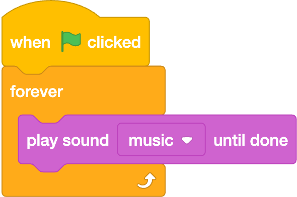
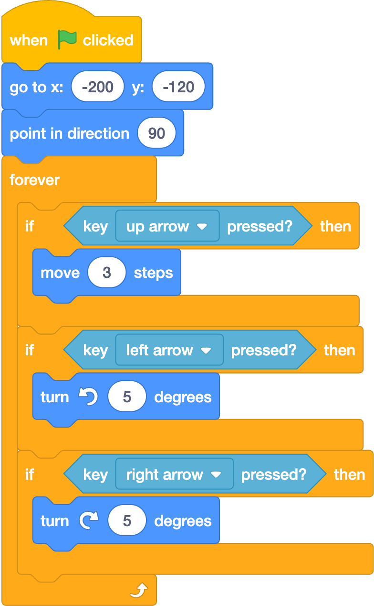

# Challenge

Choose one or more challenges to improve your Boat Race game.

## Add sound effects

You could add sound effects that play when:

- The boat crashes.
- The boat reaches the island.
- The boat touches the wooden barrier.
- The timer starts.

??? tip "How to add a sound"

    To add a sound from Scratch:

    1. Click the sprite or the Stage where you want the sound to play.
    2. Click the **Sounds** tab.
    3. Click **Choose a Sound**.
    4. Search for a sound effect, for example ==pop==, ==splash==, or ==cheer==.
    5. Click the sound to add it to your project.
    6. Go back to the **Code** tab.
    7. Add a sound block where you want the sound to play.

    To upload a sound effect:

    1. Go to [Pixabay Sound Effects](https://pixabay.com/sound-effects/).
    2. Search for a sound effect that matches your game.
    3. Download the sound file.
    4. Go back to Scratch.
    5. Click the sprite or the Stage where you want the sound to play.
    6. Click the **Sounds** tab.
    7. Click **Upload Sound**.
    8. Choose the sound file you downloaded.
    9. Go back to the **Code** tab.
    10. Add a sound block where you want the sound to play.

    You can:

    - Choose a sound from Scratch.
    - Record your own sound.
    - Upload a sound file from [Pixabay Sound Effects](https://pixabay.com/sound-effects/).

## Add background music

You could add background music to make your game feel more complete.

??? tip "How to find and add royalty-free music"

    You can find royalty-free music on [Pixabay Music](https://pixabay.com/music/).

    To add music to your Scratch project:

    1. Go to [Pixabay Music](https://pixabay.com/music/).
    2. Search for a short piece of music that matches your game, for example ==arcade==, ==race==, or ==adventure==.
    3. Preview the track before downloading it.
    4. Download the music file.
    5. Go back to Scratch.
    6. Click the **Stage**.
    7. Click the **Sounds** tab.
    8. Click **Upload Sound**.
    9. Choose the music file you downloaded.
    10. Add code to the Stage to play the music.

    Example:

    { width="50%" }

    If the music is too loud, use the sound editor in Scratch to make it quieter.

## Add another player

You could turn your game into a race between two players. Player 1 can keep using the mouse. Player 2 can use the keyboard.

??? tip "How to add a second player"

    To add a second player:

    1. Right-click the boat sprite.
    2. Choose **Duplicate**.
    3. Rename the new sprite ==Player 2==.
    4. Change the colour or costume so it is easy to tell the two boats apart.
    5. Move Player 2 to a different starting position.
    6. Add keyboard controls to Player 2.

    Player 2 could use:

    - **Up arrow** to move forward.
    - **Left arrow** to turn left.
    - **Right arrow** to turn right.

    Example:

    { width="50%" }

    Remember to add crash and winning code for Player 2 as well.

## More ideas

You could also:

- Add more obstacles to your game.
- Add green slime to your backdrop and make the slime slow the boat down.
- Add a moving obstacle, for example, a log or a shark.
- Create more levels by adding different backdrops.
- Let the player choose which level to play.
