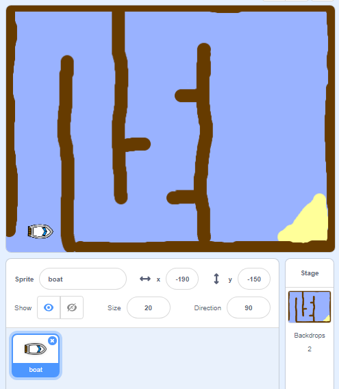

# Step 1: Getting started

Download and open the starter project in Scratch.

[Download the Boat Race starter project](BoatRace.sb3){ .md-button .md-button--primary .download-button }

??? info "How to open the starter project in Scratch"

    1. Click the **Start** button or press the **Windows** key.
    2. Type **Scratch** into the search box.
    3. Click **Scratch** to open it.
    4. Click **File** in the top menu.
    5. Choose **Load from your computer**.
    6. Go to your **Downloads** folder.
    7. Select ==BoatRace.sb3==.
    8. Click **Open**.

    Your starter project should now open in Scratch.

The project includes a boat sprite, and a race course backdrop with:

- Wood that the boat sprite has to avoid
- A desert island that the boat has to reach

