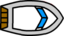
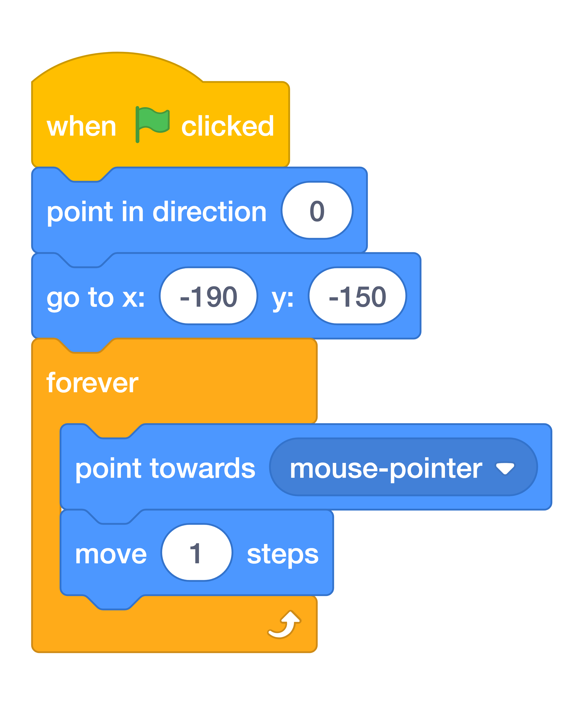
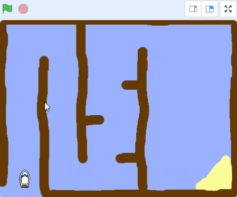
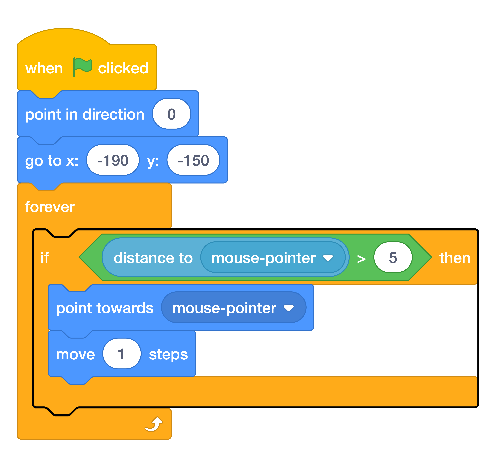

# Step 2: Controlling the boat

Add this code to the boat sprite so that it starts in the bottom left-hand corner pointing up and then follows the mouse pointer.

{ width="140" }

{ width="50%" }

??? tip "Watch: controlling the boat"

    <video controls width="720">
      <source src="assets/videos/step-2.mov" type="video/quicktime">
    </video>

Test your code by clicking the green flag and moving the mouse. Does the boat sprite move towards the mouse pointer?

What happens when the boat reaches the mouse pointer? 

==Try it out to see what the problem is.==

Add code to the boat sprite so it only points towards the mouse pointer and moves if the distance to the mouse pointer is greater than 5 pixels.

{ width="50%" }

Test your code again to check whether the problem is now fixed.
