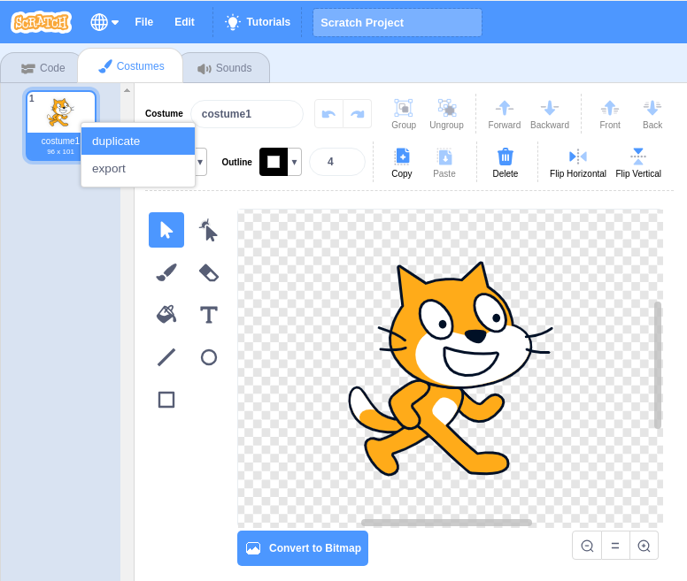
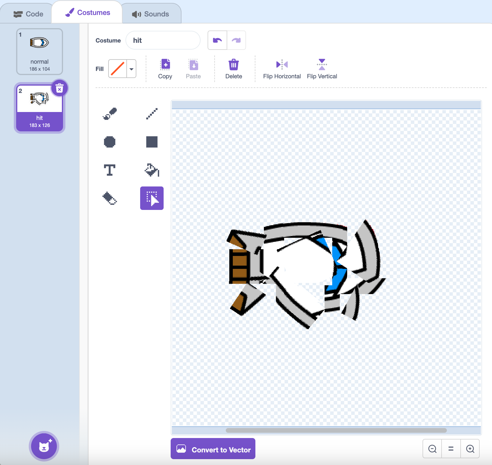
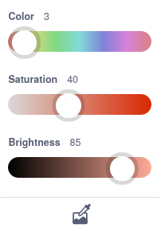
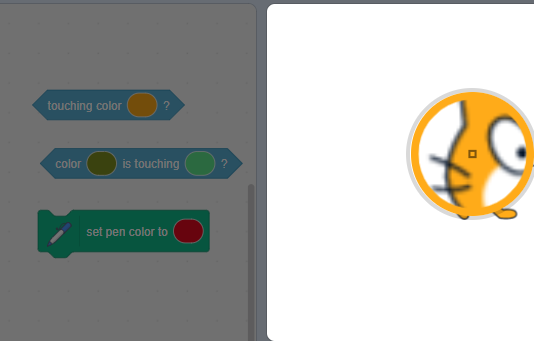
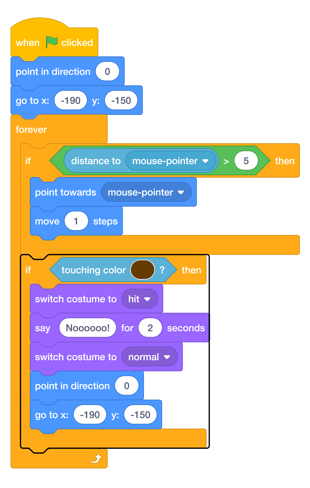
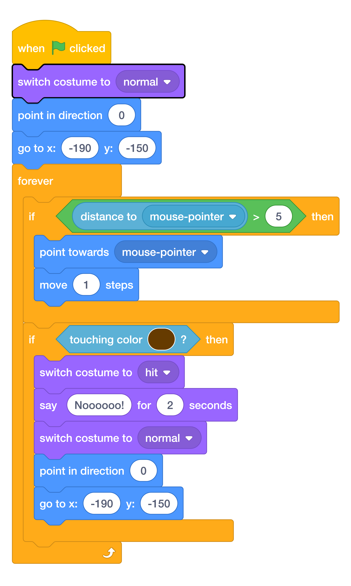
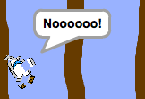

# Step 3: Crashing!

At the moment, the boat sprite can simply sail through the wooden barriers! You’re going to fix that now.

Duplicate your boat sprite’s costume, and name one costume ==normal== and the other ==hit==.

??? info "Duplicate costumes in Scratch 3"

    - Click the Costumes tab, and you’ll see your sprite’s costume.
    - Right-click on the costume and click duplicate to create a copy of the costume.

    

Click on your ==hit== costume, and use the Select tool to grab pieces of the costume and move and rotate them to make the boat look like it has crashed to pieces.



Add code blocks inside your ==forever== loop so that your code keeps checking if the boat sprite has touched any brown wooden barriers.

??? info "Set colour input with eyedropper"

    Some blocks in Scratch allow you to choose a colour.

    ```blocks
    <touching color (#20f73b) ?>

    <color (#819322) is touching (#5fe98e) ?>

    set pen color to (#e50820)
    ```

    You can choose a colour to match a colour that appears on the Stage.

    Click on the colour input to open the colour picker and then click on the eyedropper at the bottom.

    

    Move the mouse pointer over to the Stage and move around until you have selected the colour you want and then click or tap to select the colour.

    

    The colour in the block input will change to match the colour you chose. Click in the Code area to close the colour picker.

If it has crashed, reset the boat sprite’s position.

Here’s what your code should look like:

{ width="70%" }

Add code to make sure that your boat sprite always starts out looking ==normal==:

{ width="70%" }

Test your code again.

If you try to sail the boat through a wooden barrier now, the boat should crash and then move back to its starting position.

{ width="360" }
