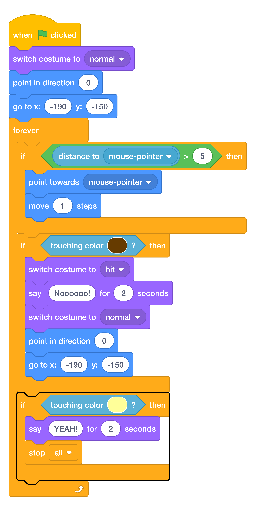
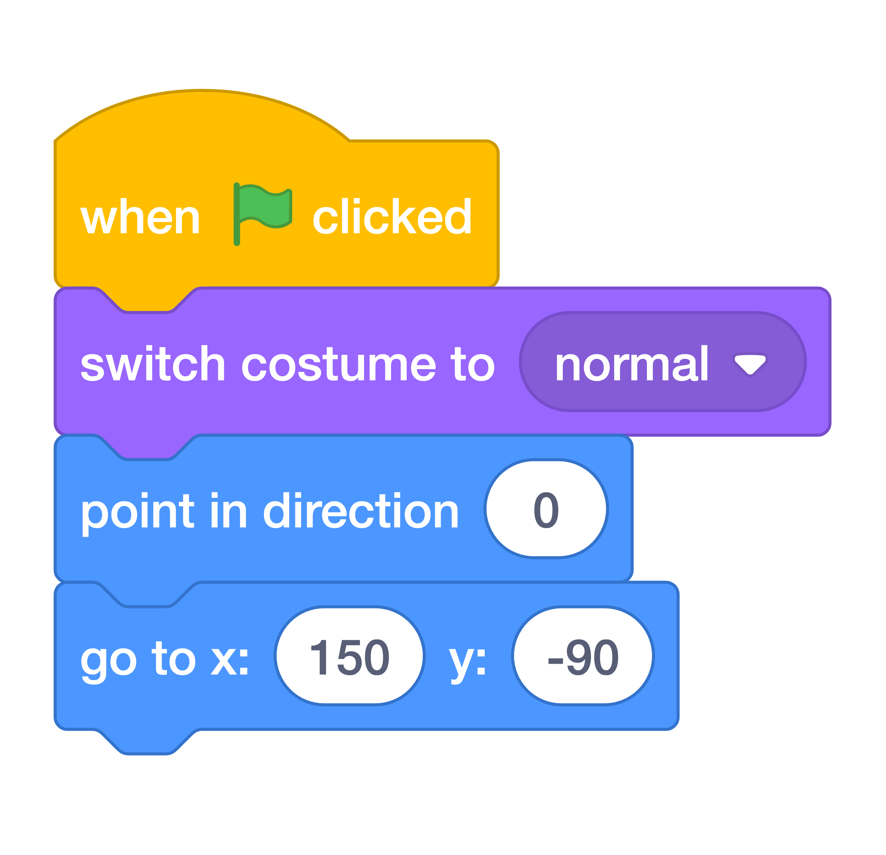

# Step 4: Winning!

When the boat gets to the island, the game should say ==YEAH!==, and then it should end.

Add more code blocks inside your ==forever== loop so that your code keeps checking if the player has won.

Here’s what your new code should look like:

{ width="50%" }

!!! warning "**Before you go any further, test your code.**"

    Click the green flag and make sure the game runs as expected. To make it a little easier to test, you can change the numbers in the first ==go to== block to be this:

    { width="50%" }

    Don’t forget to change it back once you’ve tested!
