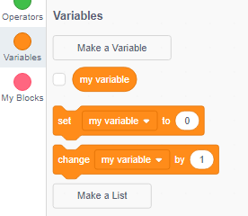
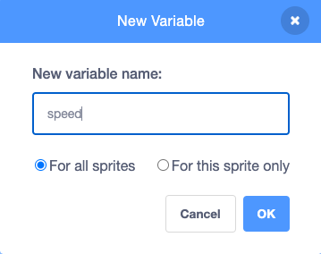
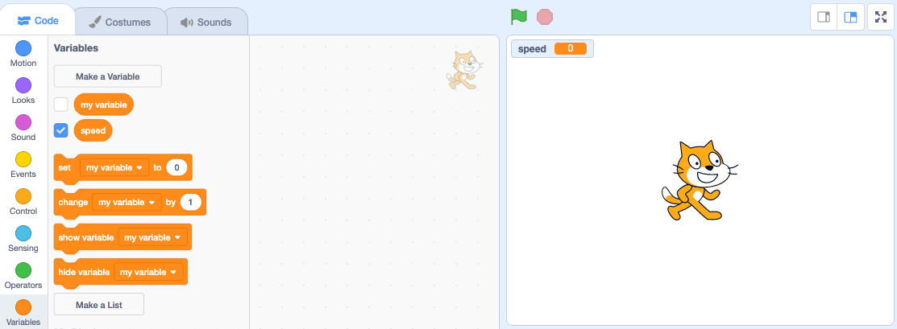
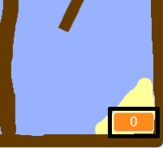
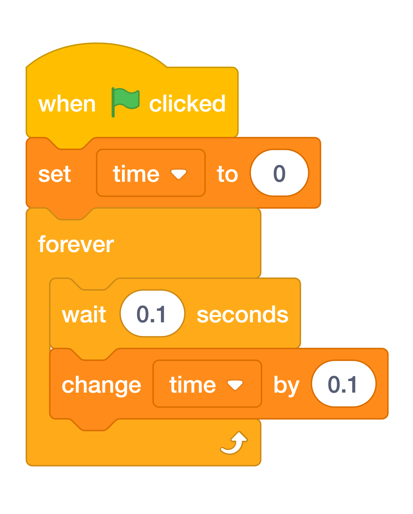
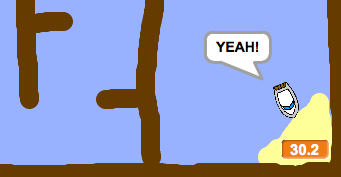

# Step 5: Adding a timer

Now you will add a timer to your game, so that the player has to get to the island as quickly as possible.

Make sure you have selected the Stage.

{ width="120" }

Add a new variable called ==time== to your Stage.

??? info "How to add a variable in Scratch"

    - Click on **Variables** in the Code tab, then click on **Make a Variable**.

    

    - Type in the name of your variable. You can choose whether you would like your variable to be available to all sprites, or to only this sprite. Press **OK**.

    

    - Once you have created the variable, it will be displayed on the Stage, or you can untick the variable in the Scripts tab to hide it.

    

{ width="360" }

Add code to your Stage so that the timer counts up in tenths (0.1) of a second.

Here’s the code to add:

{ width="50%" }

Test out your game and see how quickly you can get the boat to the island!

