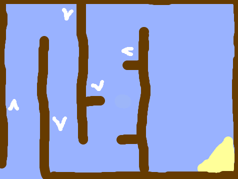
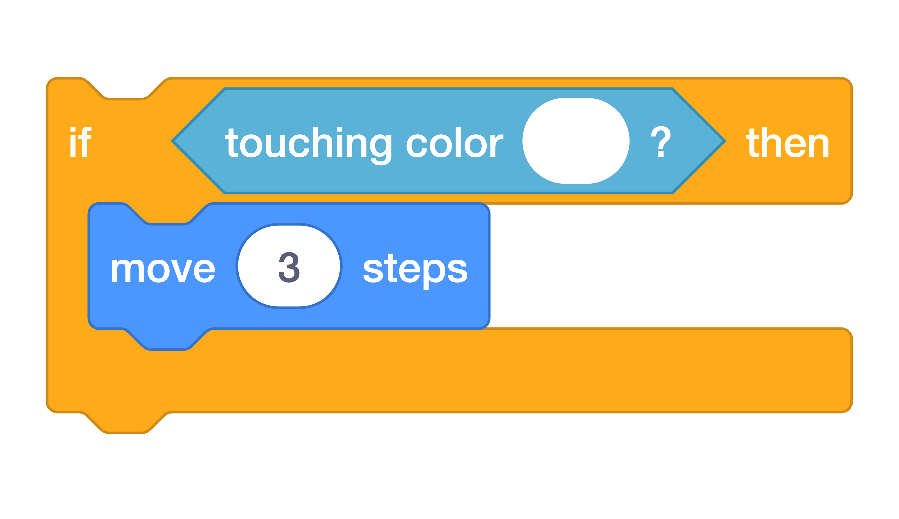
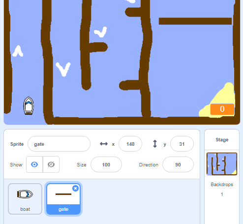
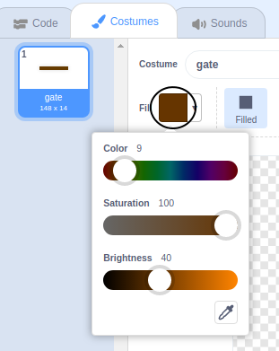
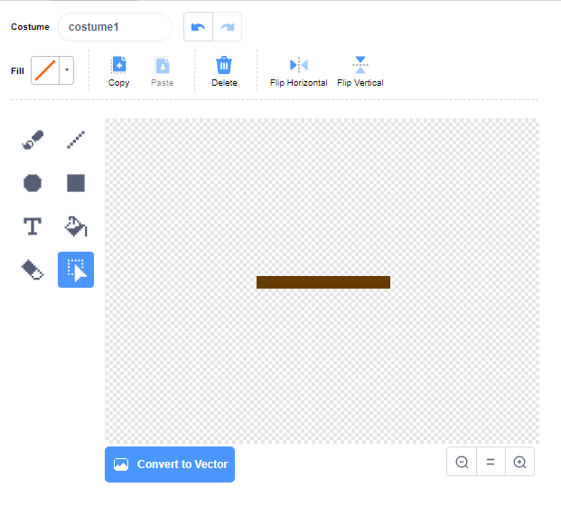
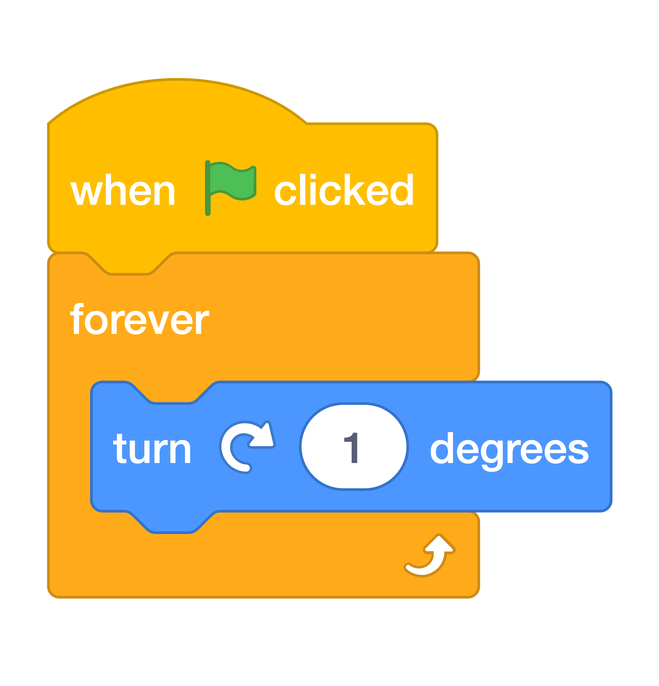
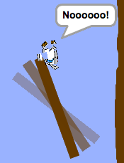

# Step 6: Obstacles and boosters

Add some new things to make your game more interesting!

First, you’ll add some boosters to speed up the boat.

Draw some white booster arrows on you backdrop by painting the backdrop on the stage.

Tip: You can make your backdrop look like this by clicking the purple ==next backdrop== block in the looks menu.

Now add more code blocks to your boat’s ==forever== loop so that the boat sprite moves three extra steps when it touches a white arrow.

{ width="70%" }

Test your game to see whether your new booster arrows speed up the boat.

Next you’ll add a spinning gate that the boat has to avoid.

Paint a new sprite that looks like this, and call it ==gate==:

Make sure that the colour of the gate sprite is the same as the colour of the wooden barriers.

Tip: If you are having trouble selecting the colour of the barriers, you can set the colours to:

- Colour: 9
- Saturation: 100
- Brightness: 40

Make sure that the centre of the gate sprite is positioned in the middle. You may need to resize the gate sprite if it is too big.

Add code blocks to the gate sprite so that it turns 1 degree forever.

Here’s what your new code should look like:

{ width="140" }

{ width="70%" }

Test your game again. You should now have a spinning gate that you need to steer your boat around.

{ width="360" }
