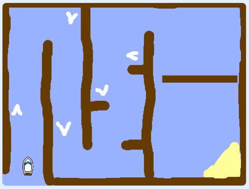
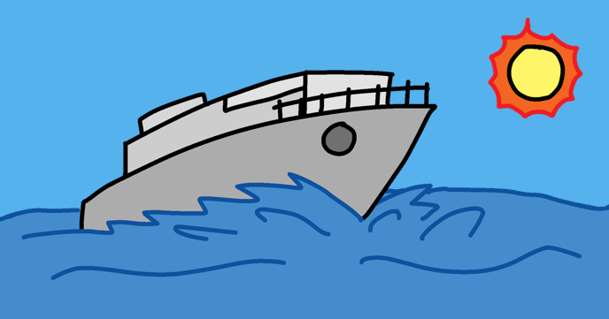

# Boat race

Create a boat-racing game in which you have to avoid obstacles.

## What you will make

Make a boat racing game! Use the mouse to navigate a boat to an island without bumping into obstacles.

## Skills you will practise

This project links to Scottish Curriculum for Excellence Technologies at Third Level.

| Skill area | What you will do in this project | CfE link |
|---|---|---|
| Designing and building solutions | Build, test, debug, and improve a working Scratch game. | TCH 3-15a |
| Programming constructs | Use events, loops, conditions, sensing, operators, variables, and costumes. | TCH 3-14a |
| Computational thinking | Break the game into smaller processes, including movement, obstacles, timing, and winning. | TCH 3-13a |
| Modelling a system | Use sprites, backdrops, variables, states, and rules to model a simple boat race. | TCH 3-13b |
| Understanding system interaction | Explore how mouse input, Scratch blocks, sprites, and the stage work together. | TCH 3-14b |

## Attribution

This project is adapted from the original [Boat race](https://github.com/RaspberryPiLearning/boat-race) learning resource published by the [Raspberry Pi Foundation](https://www.raspberrypi.org).

The original project is licensed under the [Creative Commons Attribution-ShareAlike 4.0 International License](https://creativecommons.org/licenses/by-sa/4.0/).
