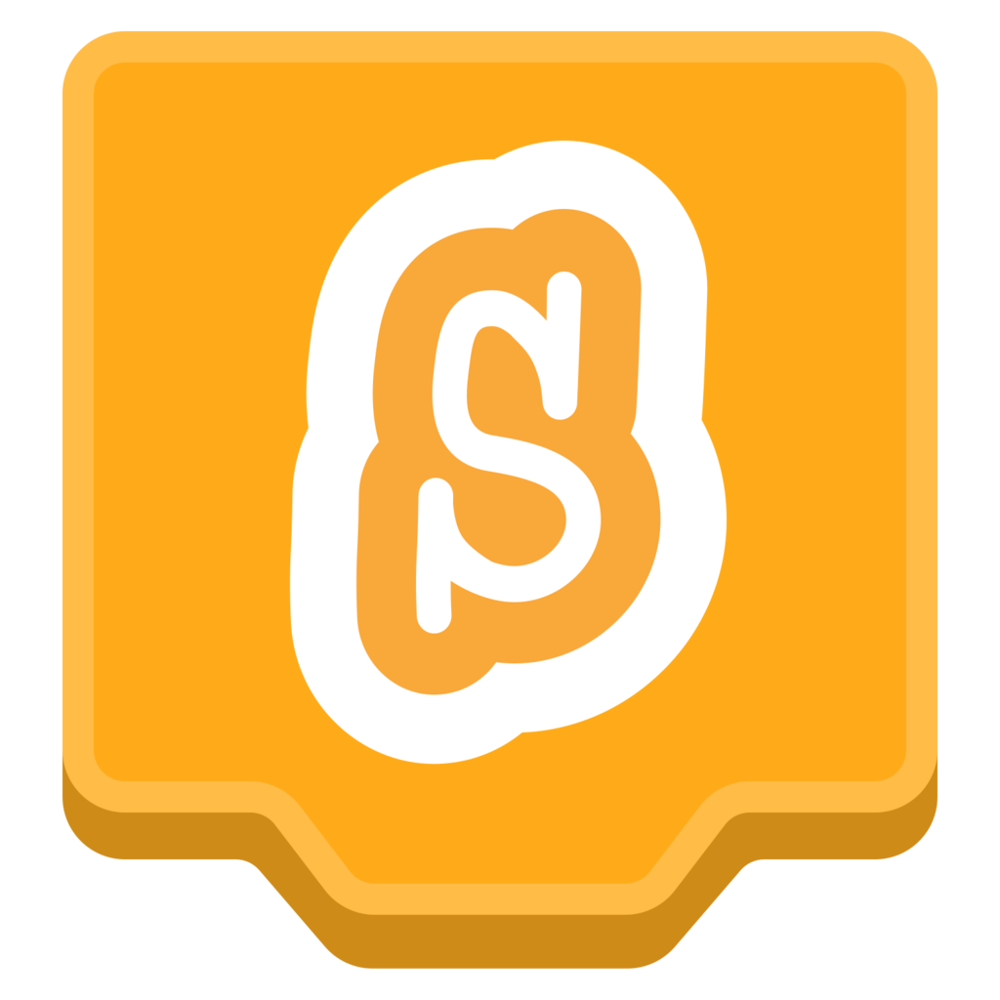

# Introduction to Scratch

{ width="180" }

Scratch is a visual programming tool that lets you create games, animations, stories, and interactive projects. Instead of typing code, you build programs by joining blocks together. This makes it easier to focus on how a program works, how instructions fit together, and how to solve problems step by step.

We use Scratch because it helps you learn important programming ideas in a clear and practical way. You can see your code running straight away, test your ideas quickly, and improve your project as you go.

## What Scratch helps us learn

Scratch helps us practise:

- Giving clear instructions to a computer.
- Breaking a problem into smaller steps.
- Using events to make something happen.
- Using loops to repeat actions.
- Using conditions to make decisions.
- Using variables to store and change information.
- Testing, debugging, and improving a program.
- Designing projects that people can use, play, or interact with.

## Why these skills matter

Programming is not just about making something work. It is about thinking carefully, solving problems, testing ideas, and learning from mistakes. Scratch gives you a safe place to practise these skills while creating something of your own.

As you work through the projects, you will become more confident at planning, building, testing, and improving digital solutions.
